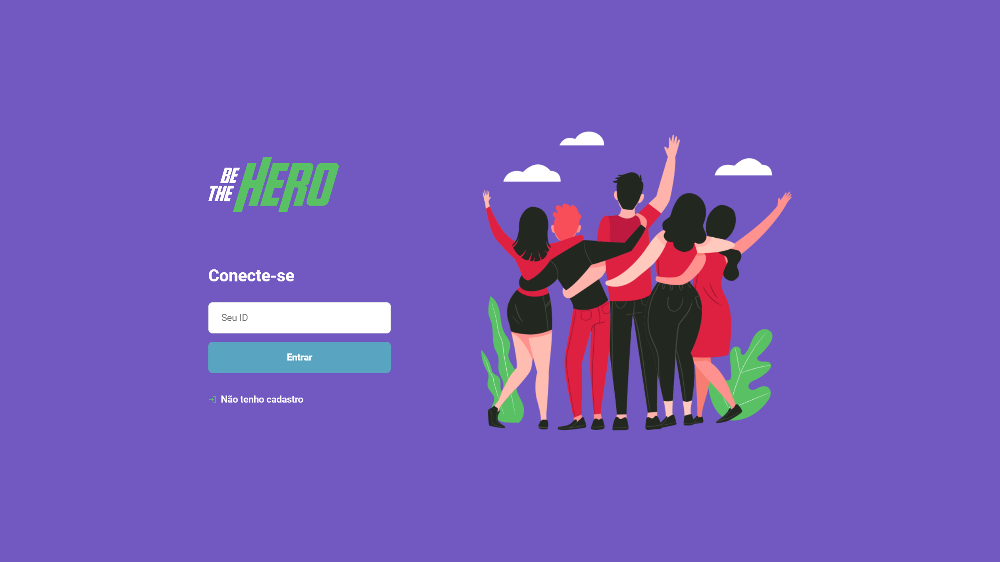
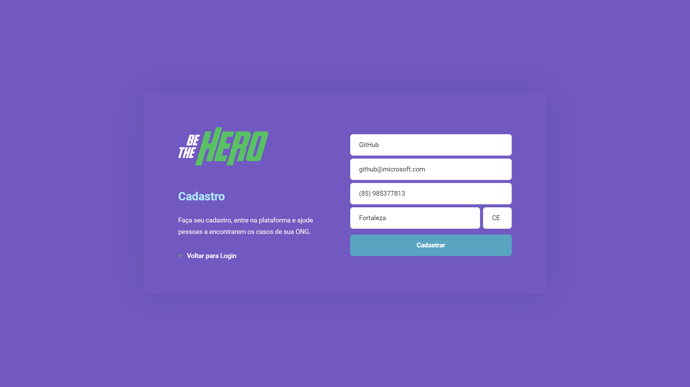
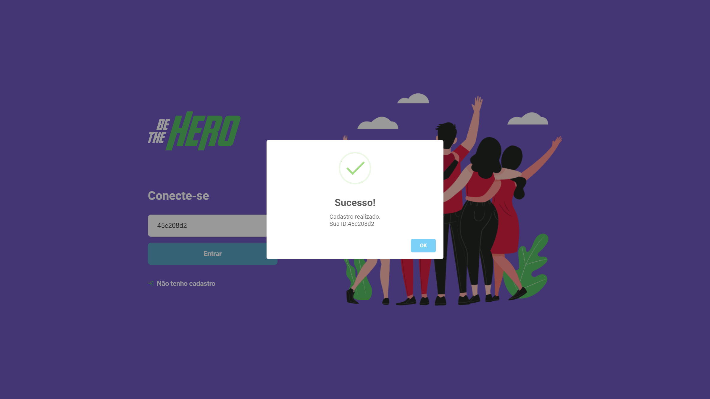
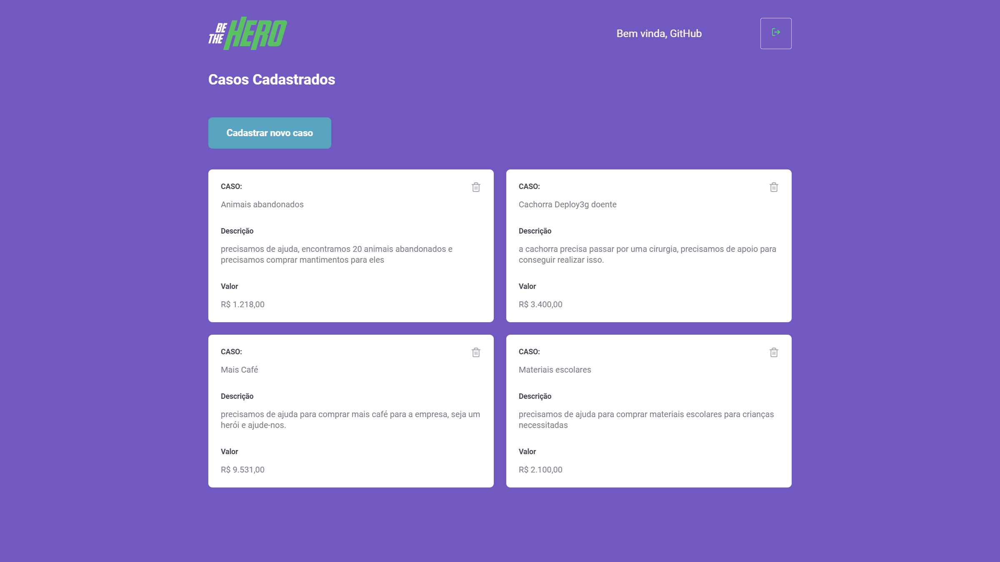

# BeTheHero **FRONT-END** - *OminiStack 11.0*

## [VISUALIZAR FRONT-END NO GITHUB-PAGES](http://honassis.github.io/BeTheHero-FrontEnd)

## [VISUALIZAR PARTE BACK-END](https://github.com/honassis/BeTheHero-BackEnd)
## [VISUALIZAR PARTE MOBILE](https://github.com/honassis/BeTheHero-Mobile)
> contato: honassislopes@gmail.com

## Sobre o sistema:
**BeTheHero** foi um sistema feito da semana [**OminiStack 11.0**](https://rocketseat.com.br/starter). Pensado em reunir ongs e e conectar pessoas com um grande e principal foco: ajudar a sociedade.

No sistema  é possivel cadastrar ongs, criar casos... pessoas podem visualizar esses casos cadastrados entrar em contato e oferecer apoio.

## Sobre o FrontEnd:
foi feito todo em React.js, e outros pacotes, como axios e sweetalert, e rotas, é possivel ver apenas as páginas estáticas [**aqui**](http://honassis.github.io/BeTheHero-FrontEnd).

existe 3 branchs do projeto, uma com uma [build estática](https://github.com/honassis/BeTheHero-FrontEnd/tree/gh-pages), também existe [o source da build estática](https://github.com/honassis/BeTheHero-FrontEnd/tree/static) e essa que você está visualizando que é a principal. 

## Outras informações: 
* execute o front com **yarn start** / **npm start**
* é possivel alterar o endereço da api em **_src/services/api.js_**
> contato: honassislopes@gmail.com

> contato: honassislopes@gmail.com
